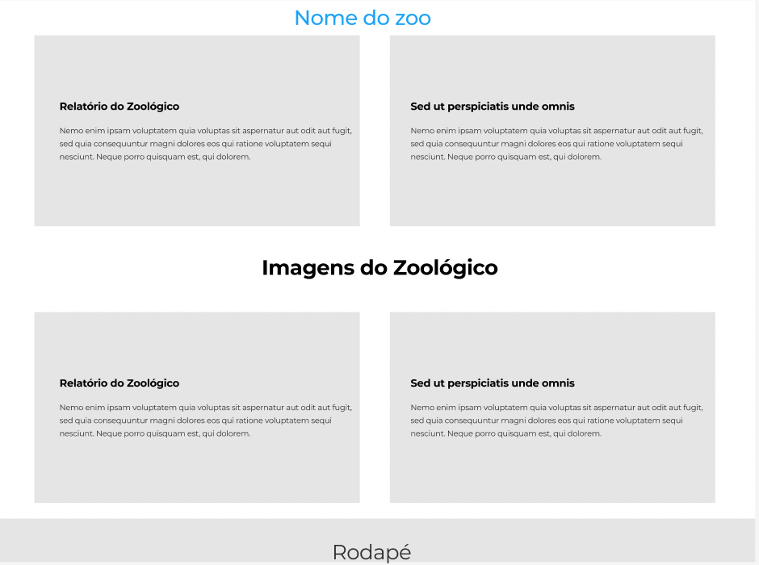

## Atividade - Site zoológico :computer:

### :pencil: Descrição da atividade: 

Fazer um site de acordo com o que foi requisitado pelo cliente.

### Email do Cliente: :email:

```
Olá, boa tarde! Meu nome é Morgana e preciso de um site para meu zoológico, 
além do ultimo relatório que você fez irei precisar de algumas informações no meu site! 

Preciso de dois blocos de texto contendo o primeiro aquele relatório dos animais e também outro bloco de texto com informações do Zoológico, 
mas depois eu coloco, deixa um texto qualquer por enquanto! 

Quero um site com o nome do meu zoológico, o nome do zoológico é [Animals Zoo] 
lá no topo do site, sabe?

vou deixar duas imagens aqui pra vc colocar uma do lado do outro, na seção de imagens zoológico. 

e no final do meu site eu vou querer de novo o nome do zoológico e o telefone, 
deixa qualquer depois eu troco e também um link que ira redirecionar 
pro meu whatsapp! 

Nesse email vou te mandar 3 arquivos, um com desenho de como eu quero meu site mais ou menos e duas fotos do zoológico!

Da uma olhadinha abaixo como quero o site, vou deixar uma imagem pra ajudar :)

Obrigada!
````




------------

